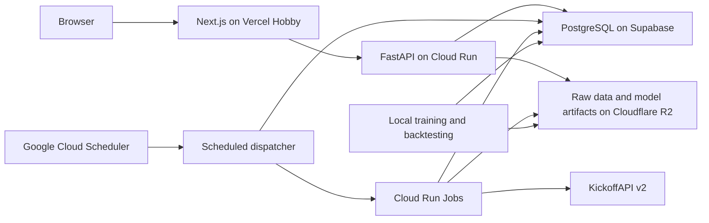

# System Architecture

Date: 2026-08-07

## Deployment topology



## Repository layout for Phase 2

```text
frontend/                 Next.js App Router application
backend/
  prem_engine_api/        FastAPI application and domain services
  migrations/             Alembic migrations
  tests/                  API, database, ingestion, and lifecycle tests
modeling/
  prem_engine_modeling/   Feature, model, evaluation, and simulation package
  tests/                  Leakage, probability, and reproducibility tests
data/
  contracts/              Versioned provider and normalized schemas
  mappings/               Reviewed identity aliases, not source datasets
docs/
  architecture/           Architecture and lifecycle decisions
  phase-1/                Feasibility evidence
infra/                    Container and deployment configuration
```

Runtime code must not depend on notebooks. Notebooks can be added later for
exploration but production features and models live in tested Python packages.

## Component responsibilities

### Next.js frontend

- Render dashboards, fixtures, match pages, clubs, standings, and model metrics.
- Replay stored simulation events using client-side time progression.
- Clearly distinguish predicted, simulated, and real data.
- Never receive provider credentials or generate football forecasts.

### FastAPI backend

- Expose read APIs for normalized product data.
- Authorize operational endpoints when introduced.
- Return prediction provenance and data freshness.
- Avoid provider ingestion and expensive inference in user request handlers.

### Scheduled dispatcher

- Run at a fixed short interval, initially every 15 minutes.
- Claim due work idempotently using database leases.
- Enforce the provider request ledger and daily budget.
- Start bounded Cloud Run Jobs rather than performing work itself.

### Cloud Run Jobs

- Synchronize provider data.
- Build immutable feature snapshots.
- Generate predictions and stored simulations.
- Ingest completed-match details.
- Recalculate evaluations and standings snapshots.
- Write raw responses to R2 before normalizing them.

### PostgreSQL

- Store internal identities, normalized data, job state, feature metadata,
  predictions, simulation timelines, evaluations, and standings.
- Enforce one active prediction version per match.
- Act as the source of truth for both internally calculated standings tables.
- Store object keys and checksums instead of large raw payloads.

### Cloudflare R2

- Preserve compressed provider responses with checksums and retrieval metadata.
- Preserve immutable historical source files.
- Store versioned model artifacts and evaluation outputs.
- Store encrypted or access-restricted database backup exports.

## Data boundaries

```text
provider response
  -> immutable R2 object
  -> raw_fetch metadata row
  -> provider-specific validation
  -> normalized domain records
  -> time-safe feature snapshot
  -> versioned model inference
  -> locked prediction and simulation
  -> post-match actuals and evaluation
```

Provider DTOs must remain outside the domain and API models. An adapter owns each
provider schema so a provider change does not redesign the prediction engine.

## Security boundaries

- KickoffAPI keys are available only to ingestion jobs.
- Database administration and migration credentials are separate from runtime
  credentials.
- Frontend clients never connect with privileged database credentials.
- Secrets are supplied by deployment secret stores and never committed.
- Logs may include endpoint names, status codes, quota values, and request IDs,
  but never keys, authorization headers, or full database URLs.
- R2 objects are private by default. Public club imagery is referenced from an
  approved source or deliberately proxied and cached.

## Reliability rules

- Every ingestion operation is idempotent.
- Raw data is stored before normalization.
- Jobs use a unique idempotency key and database lease.
- Retryable errors use bounded exponential backoff with jitter.
- Provider corrections create new actual-data revisions.
- Locked active predictions cannot be updated in place.
- Standings are calculated from canonical match records, not accepted directly
  from provider standings responses.
- Provider standings are stored only as validation observations.

## User-interface design constraints

Interface colors are restricted to:

- `#000505`
- `#3B3355`
- `#5D5D81`
- `#BFCDE0`
- `#FEFCFD`

Official club crests, competition imagery, flags, and player photographs may
retain their original colors. The supplied visual reference informs grid, card,
border, and interaction design only; no commercial components or assets will be
copied.
