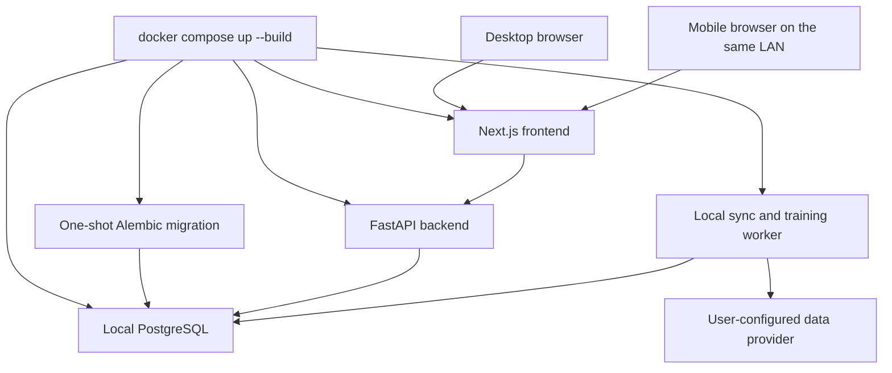

# Cloneable local architecture transition

## Purpose

Prem Engine is changing from a centrally deployed online service into a self-contained GitHub
project that each user runs on their own computer. The target product is not a shared production
website. Every clone is an independent installation with its own database, model lifecycle,
fixtures, predictions, simulations, and simulated league table.

This document defines the target architecture, the user-visible feature changes, the migration
sequence, and the cleanup required after the local replacement is verified. It supersedes the
deployment direction in the existing Phase 16C cloud documents; it does not claim that the target
has already been implemented.

## Product goals

The local edition must provide:

- a public GitHub repository that can be cloned on a desktop computer;
- Docker and Git as the only installed prerequisites;
- one primary startup command: `docker compose up --build`;
- no requirement to install Python, Node.js, pnpm, PostgreSQL, or model libraries on the host;
- an independent persistent database for every installation;
- the same approved model implementation and product features in every clone;
- per-device simulations that can differ while remaining stable after generation;
- automatic fixture, result, and player-data synchronization while the application is running;
- startup reconciliation after the application has been offline;
- local model training and chronological catch-up for missed matchweeks;
- browser access on the host computer and from mobile devices on the same local network; and
- no dependency on GCP, Oracle Cloud, Vercel, Neon, Cloudflare R2, or another application-hosting
  service.

The design targets no cloud-infrastructure bill. Users may still incur ordinary electricity,
internet, hardware, or external data-provider costs. Each user must supply their own provider
credential when current fixtures cannot be obtained from a freely distributable source.

## Non-goals

The first local edition will not provide:

- one shared database or shared simulation history across installations;
- continuous updates while the host computer or Docker is stopped;
- guaranteed exact-time background execution while the computer is asleep;
- access from outside the local network without a user-managed VPN, tunnel, or router setup;
- direct execution of the complete Docker stack on ordinary Android or iOS devices;
- retrospective simulation after the permitted play window; or
- automatic synchronization of local changes back to the repository or another user.

## Resolved implementation decisions

The following product decisions are settled for the transition:

- The Phase 7 dynamic Poisson/Dixon-Coles goal model is fully and deterministically retrained at
  each eligible matchweek cutoff. Every version uses all eligible historical data plus accepted
  current-season results available at that cutoff.
- Training waits for every non-postponed fixture assigned to the matchweek to have an accepted
  final result. Postponed fixtures are excluded without blocking later matchweeks, and every
  artifact records its exact included-fixture set.
- A played schedule revision that is later rescheduled remains immutable and replayable, becomes
  `void`, stops contributing to current coverage and standings, and is replaced by a new Play
  window for the new revision.
- A fresh installation bundles the approved Phase 7 and Phase 12 artifacts plus legally
  distributable reference data. Without a provider key it starts in a setup-required state and
  keeps Play disabled until current fixture synchronization succeeds.
- An established installation that loses provider access preserves its database and saved
  simulations, displays the last successful synchronization time, and labels stale data honestly.
- Simulations created by the old automatic shared lifecycle are retained as read-only
  `legacy_shared` audit records. They receive no invented device UUID and never affect per-device
  standings or coverage.
- Clearing browser storage, using another browser profile, or using a private browsing context
  creates a new device identity. The old identity remains stored locally but is not automatically
  claimed by the new browser identity.
- One device UUID persists across seasons, while standings and coverage remain separate per
  season. The first local edition provides no accounts or automatic device-identity recovery.
- Fixture data is considered stale four hours after the last successful fixture reconciliation.
  Play remains disabled while data is stale or startup reconciliation has not succeeded.
- Repeated or concurrent Play calls do not regenerate an already-played revision; they return the
  single existing stored simulation for that device, match, and schedule revision.

## Target runtime topology



PostgreSQL remains the initial database because the current domain model, migrations, locking,
idempotency, and lifecycle code already rely on PostgreSQL behaviour. A future packaged desktop
edition may evaluate SQLite, but SQLite is not required for the first cloneable release.

## Docker-only, one-command target

After installing Git and Docker, the intended user workflow is:

```powershell
git clone <repository-url>
cd Prem-Engine
docker compose up --build
```

The Compose project must perform all application startup work:

1. Build or pull pinned backend and frontend images.
2. Start PostgreSQL with a named persistent volume.
3. Wait for the database health check to pass.
4. Run Alembic migrations through a one-shot service.
5. Run idempotent first-start initialization.
6. Start FastAPI only after migrations succeed.
7. Start the production-mode Next.js server and connect it to FastAPI through the internal
   Compose network.
8. Start the local synchronization, maintenance, and model-training worker.
9. Reconcile fixtures, missed training cycles, and application state after an offline period.
10. Expose the frontend on a documented host port, initially `http://localhost:3000`.

The user must not need host installations of Python, Node.js, pnpm, PostgreSQL, Alembic, or the
scientific Python dependencies. The container images must include all runtime dependencies and the
approved baseline model artifacts.

If a provider key is absent, the application should start successfully in a clearly identified
unconfigured or offline-data state. Configuration may initially use a local ignored environment
file. A later local setup screen can improve onboarding, but it must never expose an existing key
back to the browser or store it in source control.

The implementation must document these lifecycle commands:

```powershell
# Start or rebuild the complete application
docker compose up --build

# Stop while preserving local data
docker compose down

# Start again with the existing database and simulations
docker compose up

# Destructive reset; removes the local database and must carry a prominent warning
docker compose down -v
```

The primary startup command must be acceptance-tested on supported Windows, macOS, and Linux
hosts. Multi-architecture images and all model dependencies must be tested on supported x86-64 and
ARM64 platforms before ARM64 is advertised as supported.

## Local ownership and data isolation

Each cloned installation owns its database. There is no central Neon database and no distributed
database synchronization between users. This prevents shared credentials, quota contention,
privacy leakage, and conflicts between different simulations.

Each installation stores locally:

- canonical fixtures, kickoff changes, statuses, and real results;
- provider synchronization and quota records;
- player context and eligible pre-match features;
- locally trained model versions and their data cutoffs;
- forecast probabilities and model metadata;
- per-device simulation seeds, events, statistics, scores, and presentation payloads;
- real and simulated standings;
- evaluation results and timing classifications; and
- fixture schedule revisions, missed states, and audit timestamps.

The PostgreSQL data directory must use a named Docker volume. Ordinary `stop`, `down`, restart,
rebuild, and host reboot operations must preserve it. The documentation must warn that deleting
the volume, using `docker compose down -v`, resetting Docker storage, or deleting application data
removes the local history.

Local backup and restore commands must be provided before the cloneable edition is considered
complete. Backups must include database content, locally trained model artifacts, configuration
metadata that is safe to export, and integrity checks. Provider secrets must not be copied into an
ordinary unencrypted backup.

## Fixture and result synchronization

Every installation synchronizes independently using its user's provider credential. The existing
application ceilings remain mandatory even though each clone has a separate provider account:

- provider hard limit: 100 requests per day and 30 requests per minute;
- Prem Engine operational limit: 85 requests per day and 25 requests per minute; and
- bounded synchronization batches and retries that never bypass the database quota ledger.

While the application is running, the initial schedule should remain:

- fixture reconciliation every four hours;
- player-context synchronization daily at a separate time; and
- local maintenance daily.

On startup, the application must:

1. determine the last successful synchronization time;
2. fetch current fixtures, statuses, and results within the remaining quota;
3. reconcile kickoff changes and preserve schedule revisions;
4. mark cancelled, postponed, voided, and completed fixtures correctly;
5. update the next/upcoming ordering using the latest canonical kickoff;
6. identify completed but unprocessed matchweeks;
7. run eligible training catch-up in chronological order; and
8. refresh derived real standings and evaluations.

No updates occur while Docker or the host computer is stopped. After reopening, the interface must
show synchronization progress, the last successful update time, and any error that leaves the
fixture list stale. It must not claim that stale local data is current.

## Model lifecycle and missed matchweeks

Training cannot run while the local application is stopped. When it starts again, the worker must
identify all completed, unprocessed training cutoffs and process them chronologically.

For example, if the active model was trained through Matchweek 4 and the application reopens after
Matchweek 6, it must:

1. synchronize the data required for Matchweek 5;
2. train and record the Matchweek 5 model version;
3. synchronize and apply only the next eligible cutoff;
4. train and record the Matchweek 6 model version; and
5. activate the newest successful version for future user-triggered simulations.

Every artifact must record its precise training-data cutoff, included fixtures, feature schema,
model version, dependency/runtime version, checksum, and training outcome. Later information must
not be assigned to an earlier matchweek. Failed catch-up training must leave the last approved
model active and present a clear local diagnostic.

Independent training can cause model artifacts and probabilities to diverge when installations
have different data availability or dependency versions. The images must therefore pin dependency
versions and deterministic training seeds where supported. The product must distinguish “same
model implementation” from a guarantee that independently trained artifacts are byte-identical.

## User-triggered simulation lifecycle

The hosted design automatically generated forecasts at T−24h and revealed a stored one-minute
presentation. The local edition changes T−24h from an execution deadline into the time at which
the Play action unlocks.

The timing notation in this document is always:

```text
T      = the current canonical scheduled kickoff time
T−24h  = exactly 24 hours before kickoff
T+45m  = exactly 45 minutes after kickoff
```

The Play window opens at `T−24h` and remains open through `T+45m`, inclusive. The `m` in
`T+45m` means minutes, never hours. Assuming `T` is the current canonical scheduled kickoff:

| Time | New simulation state |
| --- | --- |
| Before `T−24h` (more than 24 hours before kickoff) | Locked; show the availability countdown |
| From `T−24h` through `T+45m`, inclusive | Play is available |
| After `T+45m` (more than 45 minutes after kickoff) without Play | Permanently missed for that schedule revision |
| Previously played | Saved result remains viewable and replayable |

On the first valid Play request, the backend must atomically:

1. confirm the fixture and schedule revision are current;
2. confirm the current time is inside the permitted window;
3. reject cancelled, postponed, voided, or already-played revisions;
4. select and record the eligible local model version and feature cutoff;
5. generate forecast probabilities;
6. derive a stable per-device simulation seed;
7. generate and validate the complete simulation payload;
8. persist the forecast, events, statistics, score, and presentation; and
9. update the device-specific simulated table exactly once.

Repeated Play requests, concurrent requests, page refreshes, browser restarts, and application
restarts must return the stored simulation rather than creating another result.

## Per-device simulations

Every browser/device accessing an installation receives a random installation-local device UUID.
It must be stored in browser-local storage and must not be derived from hardware fingerprinting.
A stable simulation seed can be derived from:

```text
device_uuid + match_uuid + schedule_revision + model_version
```

The database uniqueness boundary must cover the match, device, and schedule revision. This allows
a desktop browser and a mobile browser connected to the same local backend to receive independent
simulations while sharing canonical fixtures and model artifacts.

With identical input data and the same trained artifact, forecast probabilities should match.
The sampled score, events, detailed statistics, and resulting simulated table may differ by
device. Once generated, a device's result must remain stable.

The application must define how browser-storage clearing is handled. A new device UUID creates a
new local simulation identity; it must not overwrite or silently adopt another device's stored
season.

## Missed simulations and simulated tables

If Play is not pressed by `T+45m`—exactly 45 minutes after kickoff—the current schedule revision
becomes `missed`.

A missed simulation must:

- remain permanently missed for that revision;
- create no forecast or simulated result;
- add no game played, points, goals for, or goals against to the simulated table;
- remain visible in a missed-fixtures view or completion summary; and
- have no retrospective generation or catch-up action.

The main simulated table should disclose its coverage, for example:

```text
86 of 90 eligible simulations played; 4 missed
```

Teams may consequently have unequal simulated games played. The application must not replace a
missed simulation with a 0-0 draw, forfeit, expected-points estimate, or the real result.

If the real fixture is officially rescheduled, the old revision remains missed for audit purposes
and the new current revision receives a new `T−24h` through `T+45m` play window.

## Timing and evaluation classifications

A simulation played before kickoff is a local pre-match simulation. A simulation played from
kickoff through `T+45m` (45 minutes after kickoff) is an in-play-time user action, but it must not
consume live score, live event, or other post-kickoff information.

The local database must record the actual generation time and classify at least:

- `pre_kickoff_user_simulation`;
- `in_play_user_simulation`;
- `missed`; and
- `void`.

Strict T−24h evaluation may include a prediction only when its exact cutoff and required input
snapshot can be proven. A locally generated entertainment simulation must never be misrepresented
as an exact T−24h production forecast merely because its play window opened 24 hours before
kickoff.

## Mobile access

The first cloneable edition runs on a desktop host. A mobile user can access it when the phone and
host are on the same local network.

The frontend must bind to an address reachable from the LAN and display or document a URL similar
to:

```text
http://192.168.1.20:3000
```

`localhost` on a phone refers to the phone, not the desktop. LAN access requires the host firewall
to permit the selected port and the router not to isolate clients. The local application must
restrict allowed origins and exposed ports appropriately; PostgreSQL must not be exposed to the
LAN by default.

The mobile browser receives its own device UUID and therefore its own saved simulation season.
The host computer, Docker services, and local network must remain available while the phone is in
use. Access from another network and a standalone mobile runtime are outside the initial scope.

Mobile acceptance must cover responsive layout, portrait and landscape widths, touch targets,
screen readers, text zoom, timer recovery after backgrounding a tab, and current Android Chrome
and iOS Safari behaviour.

## Local secrets and security

No provider key, database password intended for distribution, or user-specific secret may be
committed to GitHub or baked into an image.

The local edition must:

- provide ignored example configuration;
- generate installation-specific local database credentials where practical;
- keep provider credentials server-side and redact them from logs;
- avoid exposing PostgreSQL outside the Compose network;
- bind privileged or operational endpoints to internal networks;
- validate all Play requests on the backend rather than trusting browser time;
- rate-limit locally exposed endpoints enough to prevent accidental loops;
- use non-root containers and read-only filesystems where compatible;
- pin images and dependencies and retain vulnerability scanning and SBOM generation; and
- document safe credential rotation and local reset procedures.

The browser-provided device UUID is an identity partition, not strong authentication. The local
edition should be treated as a trusted household/developer network application unless a later
phase adds local accounts.

## Transition from the hosted architecture

Migration should occur in bounded stages so that verified domain and forecasting behaviour is not
discarded before its local replacement works.

### Stage 1: document and isolate runtime modes

- Mark the hosted Phase 16C documents as superseded for the target product while preserving their
  audit history.
- Define explicit local configuration and prevent cloud settings from being required at startup.
- Inventory all GCP, Vercel, Neon, R2, public-snapshot, and automatic T−24h dependencies.

### Stage 2: complete the Compose runtime

- Add production-ready backend and frontend Dockerfiles where necessary.
- Expand `compose.yaml` to include PostgreSQL, migrations, API, frontend, and worker services.
- Add dependency health checks, restart policies, named volumes, and internal networks.
- Prove one-command clean installation and ordinary restart persistence.

### Stage 3: local synchronization and training catch-up

- Run fixture/player synchronization through the local worker.
- Add startup reconciliation and visible stale-data state.
- Add chronological missed-matchweek training and artifact persistence.
- Prove provider hard limits across startup, scheduled runs, retries, and manual actions.

Implementation status (2026-08-14): fixture reconciliation now runs at startup, every four hours
for the active date window, and once daily for the complete active season. Player context runs on a
separate daily bounded allowance. The provider's explicit `round` value is stored as the canonical
matchweek input; kickoff order is never used to guess it. A singleton database lease prevents two
workers from performing the same operation, and the setup endpoint exposes progress, last success,
the next attempt, and secret-free failure codes.

The worker rebuilds the complete Phase 7 Poisson/Dixon-Coles model at every eligible matchweek
cutoff, including chronological catch-up after downtime. Each successful registry entry records a
cutoff revision, the exact matchweek fixture UUIDs, data and fixture-set checksums, feature schema,
runtime versions, artifact checksum, and provenance-report checksum. Later result corrections or a
voided played-then-rescheduled result create immutable replacement revisions and cascade through
affected later cutoffs. Inference switches the active pointer only after the new files and database
record succeed, so a failed rebuild leaves the last verified model active.

### Stage 4: replace automatic T−24h generation

- Add per-device UUID handling.
- Implement the `T−24h` through `T+45m` availability window (24 hours before kickoff through 45
  minutes after kickoff, inclusive).
- Generate and persist exactly one simulation per device and schedule revision on Play.
- Add permanent missed handling and remove retrospective generation.
- Update the simulated table and coverage summary.

Implemented in the Stage 4 checkpoint on 2026-08-14. The database now retains legacy shared
simulations separately from device simulations; the latter are unique by device, match, and
schedule revision. FastAPI enforces the inclusive T−24h through T+45m window and four-hour fixture
freshness boundary, records pre-kickoff versus in-play-time classifications, creates permanent
missed records, and voids old revision timelines on schedule changes. The Next.js client persists a
random UUID in local storage and uses it for Play, standings, coverage, and evaluation. Boundary,
idempotency, concurrency, separate-device, stale-data, standings, evaluation, and reschedule tests
cover the replacement lifecycle.

### Stage 5: local operations and mobile LAN support

- Add backup, restore, health, logs, disk-use checks, and local diagnostics.
- Restrict network exposure and document firewall/LAN access.
- Complete desktop and mobile-browser acceptance testing.
- Verify clean offline shutdown and correct startup recovery.

### Stage 6: remove obsolete implementation

Only after the local replacement passes acceptance, delete unnecessary hosted/deployment code and
dependencies. Do not retain dead cloud pathways “just in case” inside the active product.

The cleanup review must explicitly consider removal of:

- GCP Terraform, Cloud Run, Cloud Tasks, Cloud Scheduler, Artifact Registry, Secret Manager, and
  Google Monitoring configuration;
- Google workload-identity and container-publishing workflow steps that no longer serve the local
  release process;
- `google-cloud-tasks` and Google-specific scheduling configuration;
- Cloud Tasks gateway code, OIDC delivery assumptions, headers, tests, and database field names;
- automatic per-fixture T−24h generation, reveal-finalizer, and missed-T−24h watchdog code replaced
  by the Play-window lifecycle;
- Vercel-only deployment settings, origin-token boundaries, and hosted cache assumptions;
- public-snapshot publication, checksum proxy, CDN revalidation, and R2 snapshot code when it no
  longer serves a local requirement;
- Neon-specific deployment instructions and managed-database operational scripts not used for
  local PostgreSQL;
- cloud secret identifiers, managed IAM/service-account wiring, notification-channel resources,
  dashboards, and cloud billing controls;
- obsolete environment variables, example values, documentation, tests, scripts, migrations, and
  CI jobs; and
- duplicate compatibility layers or transitional feature flags after rollback is no longer
  required.

Database migrations containing historical cloud-oriented column names should not be rewritten
once released. Add forward migrations that rename or generalize active schema fields, and retain
the immutable migration history required to build a database from zero.

After deletion, run a repository-wide search for GCP, Cloud Run, Cloud Tasks, Cloud Scheduler,
Vercel, Neon, R2, automatic T−24h, snapshot, and hosted-only identifiers. Every remaining reference
must have a documented local purpose or be retained explicitly as historical documentation.

## Acceptance criteria

The transition is complete only when all of the following pass:

1. A clean supported host with only Git and Docker can clone the repository and start the entire
   application with `docker compose up --build`.
2. PostgreSQL, migrations, FastAPI, Next.js, synchronization, maintenance, and training services
   become healthy without host runtime installations.
3. Restarting Compose preserves fixtures, models, simulations, device seasons, and tables.
4. A missing provider key produces a usable setup/error state rather than a crash or secret leak.
5. Startup reconciliation updates fixtures and reports stale data truthfully after an offline
   period.
6. Missed matchweeks train chronologically without future-data leakage or rewriting old results.
7. Play is rejected before `T−24h` and after `T+45m`, and accepted from exactly 24 hours before
   kickoff through exactly 45 minutes after kickoff, inclusive.
8. Concurrent or repeated Play requests create exactly one stored simulation for the device and
   schedule revision.
9. Two device UUIDs can receive different stable simulations for the same fixture.
10. Closing and reopening the browser or complete Compose stack restores the same presentation.
11. A missed simulation never modifies games played, points, or goals in the simulated table and
    no retrospective action exists.
12. A rescheduled fixture preserves the old revision and creates a new play window.
13. Provider limits remain enforced during startup catch-up and periodic synchronization.
14. PostgreSQL and operational interfaces are not exposed to the LAN unnecessarily.
15. A mobile browser on the same LAN can use the supported product flows and retain its distinct
    simulation identity.
16. Backup and restore reproduce critical row counts, active model metadata, and stored
    simulations.
17. Accessibility, security, performance, model-parity, and responsive acceptance checks pass.
18. Unnecessary hosted and automatic-scheduling code has been removed, and all remaining cloud
    references are justified as active local requirements or clearly labelled historical records.

## Documentation deliverables

The implemented local edition must include:

- a concise root README quick start;
- provider-key setup and quota guidance;
- Docker lifecycle and troubleshooting commands;
- persistence, backup, restore, reset, and upgrade instructions;
- local-network mobile-access instructions;
- explanations of independent simulations, missed fixtures, and incomplete table coverage;
- offline, synchronization, training, and T−24h limitations;
- supported host platforms and minimum Docker resource recommendations; and
- a maintenance guide for updating images, dependencies, models, and database migrations.

Any future feature or dependency must be evaluated against the central distribution rule: a user
with Git, Docker, their own permitted provider credential, and one startup command must be able to
run and retain an independent Prem Engine installation without purchasing cloud hosting.
