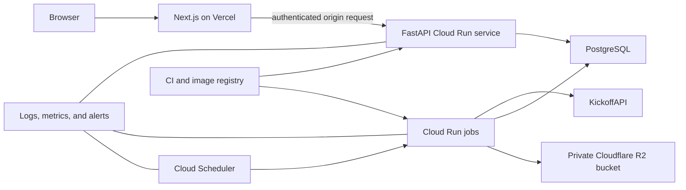

# Prem Engine deployment runbook

> **Superseded target:** The active product direction is the cloneable local architecture in
> [CLONEABLE_LOCAL_ARCHITECTURE.md](./CLONEABLE_LOCAL_ARCHITECTURE.md). Do not use this hosted
> runbook for a new local installation; it remains available only for historical audit context.

Operator commands, infrastructure-source locations, release ordering, rollback, and recurring
maintenance are documented in [DEPLOYMENT_AND_MAINTENANCE.md](./DEPLOYMENT_AND_MAINTENANCE.md).

This is the complete Phase 16C staging and production checklist for Prem Engine. Follow it in order.
Do not treat a successful container build as a successful deployment: production is ready only after
the data pipeline, T-24 job, stored simulation, public API, monitoring, and rollback path have all
been exercised in staging.

## 1. Current readiness

The following work is already implemented and locally verified:

- a general custom 404 page and a global frontend error state;
- public API rate limiting at the Next.js and FastAPI boundaries;
- adaptive official-match polling, with one coordinated leader across supported same-origin tabs;
- PostgreSQL-backed job leases, retries, idempotency, and atomic forecast locking;
- a consumer for queued `recalculate_simulated_standings` jobs;
- quota-aware current squad, injury, suspension, transfer, lineup, and performance ingestion;
- a conservative KickoffAPI ceiling of 85 requests per UTC day and 25 requests per rolling minute;
- checksum-pinned goals and detailed-statistics artifacts copied into the forecast-job image;
- a real artifact-backed T-24 rollback rehearsal; and
- the backend/modeling and frontend suites, strict Python typing, and production build checks
  required by CI.

The repository has one Alembic head: `f5c1b4d8a9e2`. Verify every deployed database independently;
the repository head does not prove that a remote migration ran.

## 2. Production stop conditions

You may create staging resources now. Do **not** release production traffic until all items below are
complete.

- [ ] Replace `LocalRawResponseStore` with durable private R2 storage in deployed ingestion jobs.
- [ ] Prove a provider response is written to R2 before its normalized transaction is committed.
- [ ] Configure automated fixture/status/result synchronization in addition to forecast and player
      jobs.
- [ ] Protect the Cloud Run API origin so callers cannot bypass the Vercel boundary.
- [ ] Add a database-aware readiness endpoint and conservative database-pool settings.
- [ ] Add production security headers and a fixed canonical site URL.
- [ ] Create and test a database backup and restoration procedure.
- [ ] Configure scheduler, job-failure, T-24, quota, API-error, and database alerts.
- [ ] Pass the real staging Cloud Scheduler to Cloud Run T-24 rehearsal.
- [ ] Commit, push, review, and merge the hardening branch through CI.

## 3. Target topology

Use separate staging and production resources. Never let a staging scheduler write to the production
database or production R2 bucket.



Recommended resource separation:

| Resource | Staging | Production |
| --- | --- | --- |
| PostgreSQL | Separate database/project | Production database/project |
| R2 | `prem-engine-staging` | `prem-engine-production` |
| Cloud Run API | `prem-engine-api-staging` | `prem-engine-api` |
| Forecast job | `prem-engine-forecast-staging` | `prem-engine-forecast` |
| Fixture-sync job | `prem-engine-fixtures-staging` | `prem-engine-fixtures` |
| Player-sync job | `prem-engine-players-staging` | `prem-engine-players` |
| Vercel | Preview/staging project | Production project/domain |
| Secrets | Staging values | Independently created production values |

## 4. Finish the remaining code boundaries

### 4.1 Durable R2 raw storage

The current `LocalRawResponseStore` writes compressed responses to a local directory. A Cloud Run
job filesystem is ephemeral, so those objects can disappear while `raw_fetches.object_key` remains
in PostgreSQL.

Before deployment:

- [ ] Introduce a raw-response storage interface shared by local and R2 implementations.
- [ ] Keep local storage as the development implementation.
- [ ] Add a private R2 implementation using the existing `R2_*` environment settings.
- [ ] Preserve the current object-key format, SHA-256 checksum, gzip compression, and append-only
      behavior.
- [ ] Never overwrite an existing key.
- [ ] Fail normalization when durable raw storage fails.
- [ ] Configure production to fail fast if it would use local storage.
- [ ] Add mocked R2 tests plus one staging write/read/checksum smoke test.
- [ ] Apply a private bucket policy and lifecycle/retention policy.

Acceptance test:

1. Run one staging provider capture.
2. Confirm the private R2 object exists.
3. Download it using an authorized operator identity.
4. Decompress it and confirm its SHA-256 matches `raw_fetches.response_checksum`.
5. Confirm an unauthenticated request cannot read the object.

### 4.2 Automated fixture, status, and result refresh

Predictions depend on canonical kickoff times. Evaluation depends on accepted final results. Player
sync alone does not update postponements, cancellations, reschedules, match status, or scores.

The existing full-season importer is quota-aware and cursor-paginated:

```powershell
python backend/scripts/import_kickoffapi_season.py `
  --league en.1 `
  --season 2026 `
  --page-size 50 `
  --max-pages 10
```

Before production:

- [ ] Deploy this command as a fixture-sync Cloud Run job.
- [ ] Run it once before enabling forecast generation.
- [ ] Resolve every pending competition, club, and match identity review.
- [ ] Schedule regular reconciliation so changed kickoff times are seen before T-24.
- [ ] Confirm finished results move predictions to the evaluated state.
- [ ] Confirm postponements/cancellations void active forecasts and cancel stale jobs.
- [ ] Confirm reschedules create a revision-scoped replacement forecast job.
- [ ] Add an alert when a sync ends before pagination is complete.

The `--season` value is the season's starting year. Change it deliberately at each season boundary;
do not calculate it from the current calendar year without checking the league season.

### 4.3 Protect the Cloud Run origin

At present, the Next.js proxy sends ordinary unauthenticated requests to FastAPI. If Cloud Run is
public, a caller can bypass the frontend rate limit and call the backend URL directly.

Choose and implement one of these before production:

1. **Cloud Run IAM/OIDC**: the strongest option when Vercel can obtain and rotate an identity token.
2. **Application origin token**: a high-entropy shared secret stored only in Vercel server settings
   and the Cloud Run secret store. Validate it for `/api/*`; leave only `/health` and `/ready`
   unauthenticated.
3. **Managed gateway/edge protection**: route the origin behind a gateway with authentication and
   distributed rate limiting.

For an application origin token:

- [ ] Generate at least 32 random bytes using a cryptographic generator.
- [ ] Use a server-only variable; never prefix it with `NEXT_PUBLIC_`.
- [ ] Compare tokens in constant time.
- [ ] Return `401` without revealing why validation failed.
- [ ] Never log the token or authorization header.
- [ ] Document rotation with an overlap window for two valid tokens.
- [ ] Verify direct unauthenticated Cloud Run `/api/*` requests fail.

The backend remains read-only publicly, but origin protection is still required to prevent database
and availability abuse.

### 4.4 Readiness and database connection control

`GET /health` currently proves that the process is running; it does not prove PostgreSQL is usable.

- [ ] Keep `/health` as a liveness endpoint without external I/O.
- [ ] Add `/ready` that runs a bounded `SELECT 1` against PostgreSQL.
- [ ] Return a non-2xx response when the database is unavailable.
- [ ] Add explicit engine pool-size, overflow, recycle, and timeout settings.
- [ ] Set conservative Cloud Run concurrency and maximum instances.
- [ ] Verify the maximum possible pooled connections across all API/job instances fits the database
      connection allowance with administrative headroom.
- [ ] Use SSL for remote PostgreSQL connections.

Use different database credentials under the same `DATABASE_URL` environment name per workload:

- migration role: schema changes only, used manually or by a migration job;
- API role: read-only access to product tables;
- job role: the minimum reads/writes needed for ingestion and forecasting.

### 4.5 Frontend security and canonical URL

Add a fixed server-side site URL instead of deriving public metadata exclusively from request host
headers.

- [ ] Configure `PREM_ENGINE_SITE_URL=https://your-domain.example`.
- [ ] Validate it as an HTTPS URL during production startup/build.
- [ ] Use it for metadata, Open Graph URLs, and canonical URLs.
- [ ] Add a restrictive Content Security Policy compatible with the deployed Next.js output.
- [ ] Add `X-Content-Type-Options: nosniff`.
- [ ] Add a restrictive `Referrer-Policy`.
- [ ] Add a minimal `Permissions-Policy`.
- [ ] Prevent framing using CSP `frame-ancestors 'none'` or the equivalent platform setting.
- [ ] Enable HSTS only after the production domain and every required subdomain work over HTTPS.
- [ ] Remove or restrict unnecessary FastAPI interactive documentation in production.

## 5. Prepare the release in source control

The current hardening work includes modified and untracked files. Do not deploy an unreviewed local
working tree.

- [ ] Review `git status` and `git diff`.
- [ ] Confirm the two required `.joblib` artifacts are included and no other ignored artifacts are
      accidentally added.
- [ ] Confirm `.env`, raw provider responses, service-account files, private keys, and database dumps
      are not tracked.
- [ ] Run a secret scan across the current tree and Git history.
- [ ] Commit the complete hardening change on `codex/phase-16c-deployment-operations`.
- [ ] Push the branch and open a pull request.
- [ ] Require the Python and frontend CI jobs to pass.
- [ ] Review dependency and container vulnerability results.
- [ ] Merge without bypassing failed checks.
- [ ] Tag or record the exact commit deployed to staging.

Local release checks:

```powershell
python -m ruff check .
python -m ruff format --check .
python -m mypy
alembic upgrade head
python -m pytest

Set-Location frontend
pnpm install --frozen-lockfile
pnpm test
pnpm lint
pnpm typecheck
pnpm build
Set-Location ..
```

The repository currently contains some older files that may fail a repository-wide formatting check
even when newly changed Python files are formatted. Resolve or explicitly review that before making
the CI check mandatory; do not silently remove the check.

## 6. Create staging infrastructure

Create staging first with the same security boundaries and commands intended for production.

### 6.1 PostgreSQL staging

- [ ] Create the staging database.
- [ ] Create separate migration-owner, API, job, backup, and isolated-restore roles.
- [ ] Run `Grant-PostgresRuntimeRoles.ps1` against the direct migration-owner URL and confirm it
      rejects elevated or unexpectedly inherited runtime roles.
- [ ] Restrict network access where supported.
- [ ] Store connection strings in the relevant platform secret stores.
- [ ] Take an initial backup.
- [ ] Apply migrations using the migration role:

```powershell
$env:DATABASE_URL = "<staging migration connection>"
alembic upgrade head
alembic current
```

- [ ] Confirm `alembic current` reports `f5c1b4d8a9e2` or the newer reviewed head present at release
      time.
- [ ] Test a backup restoration into a disposable database.

Never run Alembic using the public API role.

### 6.2 R2 staging

- [ ] Create the private staging bucket.
- [ ] Create credentials limited to that bucket.
- [ ] Configure CORS only if an approved browser flow needs it; provider raw data should not be
      browser-readable.
- [ ] Configure retention/lifecycle behavior.
- [ ] Run the raw-object checksum acceptance test.

### 6.3 Container images

Build both Dockerfiles from the repository root:

- `infra/cloud-run/api.Dockerfile`
- `infra/cloud-run/job.Dockerfile`

- [ ] Build in CI or another environment with Docker available.
- [ ] Scan the exact local image objects that will be pushed, not an earlier rebuild.
- [ ] Run as the non-root user already declared in each Dockerfile.
- [ ] Verify the API container starts on the injected `PORT`.
- [ ] Verify the job image contains both model files.
- [ ] Verify their SHA-256 checksums inside the built image:
  - goals: `fe8a19c262b6a0d8aa02e01564f6c109eec2d16e237fa276e6a414967ecf0adc`;
  - detailed statistics:
    `6859e2b0a6cd23382b795e68034b29548a6ac0a26fa9f08623cda5306cac4e12`.
- [ ] Generate SPDX SBOMs for those exact images, push them without rebuilding, and record their
      registry digests.

Promote the same tested image digest to production. Do not rebuild from an unpinned working tree.

### 6.4 Cloud Run API staging

Deploy the API image with:

- [ ] `APP_ENV=staging`;
- [ ] `LOG_LEVEL=INFO`;
- [ ] API-role `DATABASE_URL` supplied from a secret;
- [ ] backend rate-limit configuration;
- [ ] origin authentication configuration;
- [ ] explicit CPU, memory, request timeout, concurrency, minimum instances, and maximum instances;
- [ ] liveness and readiness probes; and
- [ ] no provider, R2-write, or migration credentials unless the API genuinely needs them.

Test:

- [ ] `/health` returns `200` and reports staging.
- [ ] `/ready` returns `200` with PostgreSQL available.
- [ ] `/api/matches/upcoming` returns canonical database data.
- [ ] `/api/standings` and `/api/evaluation` return valid payloads.
- [ ] direct unauthenticated origin calls are rejected.
- [ ] authenticated frontend-origin calls succeed.
- [ ] API logs contain no database URL or secret.

### 6.5 Cloud Run forecast service and jobs staging

Create the private forecast service and three scheduled job definitions from the immutable job image.

#### Private forecast task handler

```text
uvicorn prem_engine_api.forecast_task_app:app --host 0.0.0.0 --port 8080
```

Environment/secrets:

- job-role `DATABASE_URL` and a dedicated runtime service account;
- both artifact paths and checksums;
- task queue name, job lease, and bounded attempt settings;
- `SIMULATION_PRESENTATION_SECONDS=60`;
- `PUBLIC_SNAPSHOT_STORE=r2`, the dedicated public snapshot bucket, and its write-only credentials.

Do not grant `allUsers`. Grant `roles/run.invoker` only to the dedicated Cloud Tasks OIDC service
account. Cloud Run IAM/OIDC authenticates the caller; task headers bind the request to the persisted
ledger but are not caller identity. This service does not call KickoffAPI.
It receives no private raw-response bucket credential.

#### Fixture reconciliation

```text
python backend/scripts/import_kickoffapi_season.py --league en.1 --season 2026 --page-size 50 --max-pages 10
```

Environment/secrets:

- job-role `DATABASE_URL`;
- `KICKOFF_API_KEY`;
- daily/minute quota settings;
- private raw-response R2 credentials and production-selected raw storage;
- separate public-snapshot R2 bucket and write credentials;
- Cloud Tasks project, location, queue, target URL, and OIDC service-account email.

#### Player-context synchronization

```text
python backend/scripts/sync_player_context.py --league en.1 --season 2026 --max-requests 16 --max-squads 10 --max-matches 2
```

Use the same provider, database, and R2 boundaries as fixture reconciliation.

#### Maintenance and task reconciliation

```text
python backend/scripts/run_maintenance.py
```

Grant the database worker role, queue-enqueuer permission, and public-snapshot-only R2 writer, but
no provider or private raw-response credentials. This job retries pending task creation, refreshes
derived snapshots, and emits quota and missed-T-24 operational signals without provider requests.

For every job:

- [ ] use a dedicated service account with only the permissions it needs;
- [ ] prevent overlapping executions where appropriate;
- [ ] set bounded timeouts and retries;
- [ ] send stdout/stderr to centralized logs;
- [ ] verify a failed execution becomes visible to monitoring; and
- [ ] never place secret values directly in command arguments.

### 6.6 Staging scheduler

Three scheduler entries fit the intended topology. Use UTC and keep provider jobs separated so their
rolling-minute calls cannot overlap.

Suggested initial schedule:

| Scheduler | UTC cron | Provider calls |
| --- | --- | ---: |
| Fixture reconciliation | `0 */4 * * *` | normally 8, hard command cap 10 |
| Player context | `15 2 * * *` | hard cap 16 |
| Maintenance/task reconciliation | `30 3 * * *` | 0 |

At the command caps, fixture reconciliation uses at most 60 requests across six daily runs and the
player cycle uses at most 16, for 76 planned requests. The database operational ceiling stops all
work at 85 and retains the provider hard-limit reserve from 85 to 100.

- [ ] Use a scheduler service account authorized only to execute the intended job.
- [ ] Do not expose a public unauthenticated job-trigger endpoint.
- [ ] Configure retry limits so scheduler retries cannot create an unbounded storm.
- [ ] Confirm database idempotency prevents duplicate forecast effects.
- [ ] Confirm the queue permits one dispatch per second and one concurrent delivery.
- [ ] Confirm each task uses OIDC and the forecast service rejects unauthenticated requests.
- [ ] Alert on a failed or missing scheduled execution.
- [ ] Recalculate this budget before adding endpoints, pages, or schedules.
- [ ] Check the provider ledger daily during the first production week.

If actual season pagination exceeds ten pages, do not simply raise the cap. Recalculate the entire
daily budget first.

### 6.7 Vercel staging

Configure server-only environment variables:

```dotenv
PREM_ENGINE_API_BASE_URL=<staging Cloud Run API URL>
PREM_ENGINE_SITE_URL=<staging HTTPS URL>
PREM_ENGINE_SNAPSHOT_BASE_URL=<staging public snapshot HTTPS origin>
PREM_ENGINE_SNAPSHOT_STALE_IF_ERROR_SECONDS=21600
PREM_ENGINE_RATE_LIMIT_ENABLED=true
PREM_ENGINE_RATE_LIMIT_REQUESTS=60
PREM_ENGINE_RATE_LIMIT_WINDOW_SECONDS=60
```

Add the server-only origin credential if that protection option was selected. Never prefix it with
`NEXT_PUBLIC_`.

- [ ] Deploy the exact reviewed commit.
- [ ] Confirm the API base URL is not embedded as a browser-callable provider secret.
- [ ] Verify homepage, fixtures, match, standings, evaluation, model, donation, error, loading, and
      general 404 views.
- [ ] Verify mobile and desktop layouts.
- [ ] Verify Open Graph/canonical URLs use the fixed staging URL.
- [ ] Verify security headers from the deployed response, not only local configuration.

## 7. Load and validate staging data

Do this before the T-24 rehearsal.

1. Import the canonical fixture season.
2. Review pending identity cases.
3. Resolve every identity needed by upcoming fixtures.
4. Run player-context synchronization until both clubs of the rehearsal fixture have adequate squad
   coverage.
5. Confirm each club has at least 14 eligible canonical players, including an identified goalkeeper
   and enough position coverage for eleven starters plus three substitutes.
6. Confirm the rehearsal fixture has an exact timezone-aware kickoff and
   `prediction_due_at = kickoff - 24 hours`.
7. Confirm no existing active prediction blocks the rehearsal fixture.
8. Confirm provider raw objects exist in R2 with matching database checksums.
9. Confirm sanitized public snapshot payloads and manifests exist only in the separate public bucket.
10. Confirm the provider daily ledger reflects exactly the requests made.

Useful manual commands:

```powershell
python backend/scripts/import_kickoffapi_season.py --league en.1 --season 2026 --max-pages 10
.\scripts\sync-player-context.ps1 -League en.1 -Season 2026
```

Do not invent players or manually insert fake production squad data to make the rehearsal pass.

## 8. Run staging acceptance tests

### 8.1 Application smoke tests

- [ ] Homepage loads without console errors.
- [ ] Upcoming fixtures come from PostgreSQL.
- [ ] Unknown URLs show the general 404 page.
- [ ] API-unavailable state is understandable and does not fabricate content.
- [ ] Public API rate-limit headers are present.
- [ ] A controlled staging burst receives `429` and `Retry-After`.
- [ ] Hidden match tabs pause polling.
- [ ] Multiple supported-browser tabs share one polling leader.
- [ ] A live 60-second presentation stays comfortably under the 60/minute frontend limit.

Do rate-limit stress checks only in staging.

### 8.2 Local-style rollback rehearsal against staging

The rehearsal runs real model artifacts and rolls back all generated rows:

```powershell
python backend/scripts/rehearse_t24_forecast.py --match-uuid <staging-match-uuid>
```

Expected result:

- status is `passed`;
- `rolled_back` is `true`;
- a real expected lineup and forecast were built;
- the simulation transitioned from live to complete;
- the final score was hidden before completion; and
- no rehearsal prediction, simulation, or job remained committed.

### 8.3 Real Scheduler to Cloud Run T-24 rehearsal

This rehearsal must exercise the deployed scheduler and job, not the local CLI.

1. Select a staging fixture with complete real player coverage.
2. Make its generation job due immediately in staging without changing production data.
3. Invoke it through the real Cloud Scheduler identity.
4. Confirm Cloud Run claims one job lease.
5. Confirm one feature snapshot, expected lineup, prediction, and stored simulation commit atomically.
6. Confirm the public lifecycle moves `generating` to `live` to `complete`.
7. Confirm future events and the final score remain hidden until their presentation time.
8. Confirm every viewer sees the same checksum and event stream.
9. Confirm the reveal-finalization task reaches the actual 60-second presentation boundary and
   publishes the complete forecast and simulated standings snapshots without a one-minute retry
   delay.
10. Confirm the revision-scoped watchdog runs at T-24 plus the configured grace period. A current
    fixture without a locked forecast must emit `t24_forecast_missing`; a healthy or stale revision
    must not emit a false alert.
11. Confirm manifest length/SHA-256 integrity and that no unreleased event was ever public.
12. Confirm a duplicate invocation reuses or ignores existing work without duplicating a prediction.
13. Dispatch `production-acceptance.yml` with the snapshot origin, `forecast/<match-uuid>`, and
    expected lifecycle `complete`; retain its checksum, length, freshness, and private-endpoint
    boundary evidence.

### 8.4 Failure drills

Run these only in staging:

- [ ] Cause one forecast attempt to fail and confirm bounded retry behavior.
- [ ] Confirm terminal failure after the configured maximum attempts.
- [ ] Confirm alerts contain safe error codes, not secrets or raw payloads.
- [ ] Temporarily make PostgreSQL unavailable and confirm `/ready` fails.
- [ ] Confirm the API recovers after PostgreSQL returns.
- [ ] Test a provider 404 for optional fixture-player coverage; the cycle should record it and
      continue safely.
- [ ] Test provider minute exhaustion; no request above the local ceiling should leave the service.
- [ ] Test daily budget exhaustion; optional work must stop before the hard provider limit.
- [ ] Reschedule a staged fixture and confirm old jobs/predictions are voided or replaced correctly.
- [ ] Deliver the obsolete revision task and confirm it returns success as stale without generating.
- [ ] Confirm the event-time watchdog triggers a missing-forecast alert at T-24 plus the chosen
      grace period without requiring a frequent database-polling schedule.

## 9. Monitoring and alerting

Create dashboards or queries before production. At minimum, monitor:

- Cloud Scheduler executions and failures;
- Cloud Run API request count, latency, 4xx, 429, and 5xx rates;
- Cloud Run job starts, successes, failures, duration, and retries;
- Cloud Tasks creation failures, stale deliveries, retry attempts, and private handler 5xx responses;
- pending, leased, running, retried, failed, and cancelled job counts;
- forecasts missing after T-24 plus a small grace period;
- provider daily request count and reported rolling-minute remaining value;
- R2 write failures and raw-fetch rows whose objects cannot be found;
- public snapshot publication failures, manifest age, and checksum/length mismatches;
- PostgreSQL connectivity, connection use, storage, and backup age;
- identity-review backlog;
- upcoming fixtures without adequate squad/goalkeeper coverage; and
- frontend server errors and failed backend proxy calls.

Required alerts:

- [ ] any scheduler execution failure;
- [ ] any terminal forecast job failure;
- [ ] no active forecast shortly after T-24;
- [ ] provider request count approaching 85;
- [ ] provider-reported remaining count reaches zero;
- [ ] repeated API 5xx responses;
- [ ] database readiness failure;
- [ ] R2 persistence failure;
- [ ] public snapshot publication failure from either the forecast service or a scheduled job;
- [ ] backup older than the chosen recovery policy; and
- [ ] unexpected increase in pending identity cases.

Logs may contain endpoint names, job UUIDs, safe error codes, request IDs, rate-limit counts, and
checksums. They must not contain API keys, origin tokens, R2 secrets, authorization headers, raw
provider bodies, player bulk payloads, or complete database URLs.

## 10. Backup and recovery

Before every production migration:

- [ ] create a database backup;
- [ ] record its timestamp, checksum, encryption state, and retention date;
- [ ] store it privately, separate from the primary database;
- [ ] confirm the operator can restore it into a disposable environment; and
- [ ] record the current Alembic revision and deployed image digests.

Define these recovery decisions before launch:

- recovery point objective: how much recent data can be lost;
- recovery time objective: how long restoration may take;
- who may trigger a restore;
- how schedulers are disabled during recovery; and
- how database writes are prevented while deciding between roll-forward and restore.

Prefer forward fixes for schema problems. Do not run an Alembic downgrade against production unless
that exact downgrade was tested with a restored production-like backup.

## 11. Production deployment sequence

Proceed only when staging acceptance and failure drills pass.

1. **Freeze the release**
   - Record the reviewed Git commit and container image digests.
   - Stop unrelated changes from entering the release.

2. **Create a production backup**
   - Verify it is complete and restorable.

3. **Configure production secrets**
   - Create new production values; do not copy staging secrets.
   - Grant each service only the secrets it needs.

4. **Apply production migrations**
   - Use the migration role.
   - Verify the expected Alembic revision.

5. **Deploy Cloud Run jobs with schedulers disabled**
   - Use the staging-tested image digest and commands.
   - Run one manual fixture sync and inspect it.
   - Run one manual player sync and inspect quota/R2 evidence.

6. **Deploy the Cloud Run API**
   - Use the staging-tested image digest and runtime limits.
   - Verify liveness, readiness, origin authentication, and read APIs.

7. **Deploy Vercel production**
   - Use the reviewed commit and production server-only variables.
   - Verify the frontend talks only to the intended production API.

8. **Run production smoke tests**
   - Check homepage, fixtures, one official match, standings, evaluation, 404, headers, and logs.
   - Do not run destructive rate-limit or failure drills against production.

9. **Enable schedulers one at a time**
   - Fixture reconciliation first; inspect one success.
   - Player context next; inspect request count and R2 objects.
   - Maintenance last; inspect task reconciliation and confirm it makes no provider calls.
   - Enable `forecast_task_scheduling_enabled` only after private-handler and queue IAM checks pass.

10. **Enable alerts and watch the release**
    - Keep an operator available through at least one fixture sync, player sync, and real T-24 cycle.

## 12. Production acceptance criteria

Production is accepted only when every item below is true.

- [ ] Frontend uses HTTPS and the intended canonical domain.
- [ ] Security headers are visible on real responses.
- [ ] No provider or origin secrets appear in browser JavaScript or network responses.
- [ ] Direct unauthenticated backend `/api/*` access fails.
- [ ] API liveness and readiness both behave correctly.
- [ ] Database roles are separated and least-privileged.
- [ ] Current migration revision matches the release.
- [ ] A current restorable backup exists.
- [ ] R2 raw responses are durable, private, and checksum-valid.
- [ ] Fixture sync updates schedule/status/result revisions.
- [ ] Player sync populates adequate upcoming squad context.
- [ ] Provider request counts remain under both local limits.
- [ ] Exactly one revision-scoped task is scheduled within the 30-day window without duplicate predictions.
- [ ] A real fixture receives its locked prediction at T-24.
- [ ] The simulation reveals consistently for all viewers and withholds future state.
- [ ] Simulated standings recalculate after presentation completion.
- [ ] Evaluation updates after the accepted real result arrives.
- [ ] Alerts reach the intended operator.
- [ ] Logs contain no secrets or raw sensitive payloads.

## 13. Rollback plan

Prepare rollback commands and permissions before the release.

### Frontend rollback

- Reassign production traffic to the previous known-good Vercel deployment.
- Verify its backend/environment compatibility before switching.

### API rollback

- Route traffic to the previous Cloud Run revision/image digest.
- Keep the database schema forward-compatible where possible.

### Job rollback

- Disable scheduler entries first to stop new writes.
- Terminate only the exact failed execution when safe.
- Redeploy the previous known-good job image digest.
- Inspect leased/running jobs before re-enabling schedules; expired leases are recovered by the
  bounded retry system.

### Database incident

- Disable all write-capable jobs.
- Preserve logs and the current database before attempting repair.
- Prefer a reviewed forward migration/fix.
- Restore only after confirming the scope, backup integrity, and accepted data-loss window.

### Provider quota incident

- Stop optional/player sync work first.
- Preserve fixture correctness and the 15-request hard-limit reserve.
- Do not rotate keys or create extra accounts to evade provider limits.
- Resume only after the provider window resets and the ledger agrees with provider headers.

## 14. Ongoing operating routine

### Daily

- [ ] Review failed/retried jobs and scheduler executions.
- [ ] Check provider daily and rolling-minute budgets.
- [ ] Check R2 write failures and identity-review backlog.
- [ ] Confirm upcoming T-24 fixtures have sufficient player coverage.
- [ ] Confirm backup freshness.

### Before each matchday

- [ ] Confirm fixture reconciliation has current kickoff times/statuses.
- [ ] Confirm each fixture has exact kickoff precision and resolved identities.
- [ ] Confirm squads contain enough eligible players and a goalkeeper.
- [ ] Confirm the forecast scheduler and T-24 alert are enabled.

### After each matchday

- [ ] Confirm final statuses and scores were ingested.
- [ ] Confirm player lineups/performances were captured where provider coverage exists.
- [ ] Confirm predictions moved to evaluated when accepted results became available.
- [ ] Confirm real, simulated, and fair-comparison standings/evaluation endpoints updated.
- [ ] Review how many provider calls the matchday actually consumed.

### Periodically

- [ ] Restore a backup into a disposable environment.
- [ ] Rotate origin, database, provider, and R2 credentials according to policy.
- [ ] Review dependency and image vulnerabilities.
- [ ] Review Cloud Run/database capacity and cost.
- [ ] Recheck provider contracts and pagination behavior before each new season.
- [ ] Rehearse scheduler/job failure and recovery in staging.

## 15. Final go/no-go decision

Use this decision rule:

- **Go to staging:** local tests and build pass, artifacts are present, and no secrets are tracked.
- **Go to production:** every production stop condition is complete, staging has passed the real
  scheduler T-24 rehearsal and failure drills, backups/restoration work, and alerts are delivering.
- **No-go:** raw responses would be ephemeral, fixture refresh is manual, the backend origin is
  bypassable, the database cannot be restored, T-24 has not passed through the deployed scheduler,
  or a required alert is missing.

Record the final decision with the Git commit, image digests, migration revision, backup identifier,
staging rehearsal result, known limitations, approver, and UTC timestamp.
