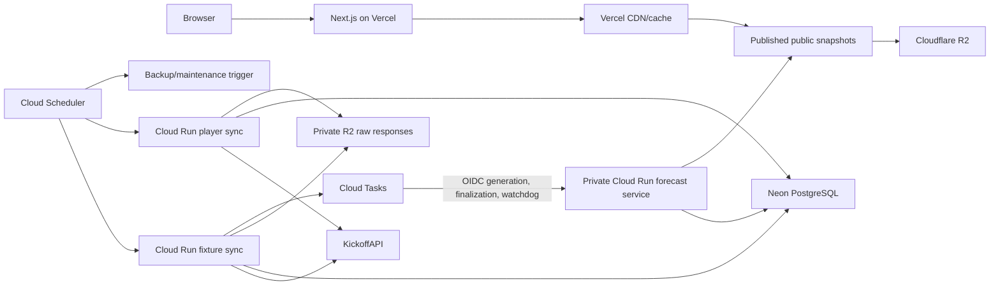

# Free-tier deployment architecture

> **Superseded target:** The active product direction is the cloneable local architecture in
> [CLONEABLE_LOCAL_ARCHITECTURE.md](./CLONEABLE_LOCAL_ARCHITECTURE.md). This document is preserved
> as historical Phase 16C design context and is not the target deployment architecture.

This document records the deployment decisions and measurements agreed during Phase 16C planning.
It is implementation context for future Codex work; it does not claim that the architecture has
already been implemented or deployed.

## Decision summary

Prem Engine replaces the every-minute database-backed T-24 dispatcher with scheduled Google Cloud
Tasks. Fixture synchronization creates a revision-scoped generation task and watchdog for each
fixture due within Cloud Tasks' 30-day scheduling window, plus a reveal finalizer when public
snapshots are enabled. At `kickoff - 24 hours`, the generation task invokes a private request-based
Cloud Run forecast service using OIDC.

The intended low-cost topology is:

Neon PostgreSQL remains the system of record. R2 public snapshots are derived, read-only delivery
artifacts and must not become the authoritative source for migrations, locking, idempotency, or
forecast state.

## User experience

This is a backend scheduling and delivery change. It must not change how a visitor uses the site:

- existing URLs, navigation, pages, and frontend API contracts remain stable;
- forecasts are still generated at T-24;
- the countdown continues in the browser from an absolute server timestamp;
- the stored 60-second presentation remains identical for all viewers;
- future simulation events and the final score remain hidden until their reveal time; and
- fixture, prediction, standings, evaluation, and model pages continue to behave normally.

Publishing a new snapshot should trigger Vercel cache invalidation or on-demand revalidation. A
short propagation delay is acceptable, but the deployed acceptance test must verify that a T-24
forecast becomes visible within the selected grace period.

## T-24 scheduling design

### Creating tasks

After each successful fixture reconciliation, inspect canonical fixtures whose prediction due time
falls within the next 30 days. Create deterministic tasks for each current fixture schedule
revision, with:

- a deterministic task identity derived from the fixture UUID and schedule revision;
- the fixture UUID and schedule revision in the authenticated request payload;
- `scheduleTime` equal to the canonical `prediction_due_at` value;
- an OIDC service identity authorized only to invoke the forecast handler;
- bounded retry attempts, duration, and exponential backoff; and
- no database URL, provider key, R2 credential, or other secret in its payload or name.

Task creation and task delivery are at-least-once operations. Both the scheduler and forecast
handler must therefore remain idempotent.

### Handling reschedules

Cloud Tasks already created for an older kickoff may still be delivered. Before claiming or
generating a forecast, the Cloud Run handler must verify all of the following in one safe workflow:

1. the fixture still exists and is eligible for forecasting;
2. the supplied schedule revision is still current;
3. the fixture has not been postponed, cancelled, or voided;
4. the prediction due time is actually due; and
5. no active prediction already satisfies that revision.

A stale task must exit successfully without creating forecast data. The existing PostgreSQL job
leases, revision-scoped uniqueness, atomic forecast locking, and duplicate protection remain the
last line of defence.

### Forecast execution boundary

Prefer a private request-based Cloud Run service with minimum instances set to zero. Before
production, measure the real forecast duration against the Cloud Tasks request deadline. If it
cannot reliably complete inside that deadline, retain Cloud Tasks as the exact-time trigger but
have the authenticated handler start an idempotent Cloud Run Job. Do not restore the every-minute
database poller merely to accommodate a long-running forecast.

## Scheduled work and provider limits

The original dispatcher ran every minute, creating 43,200 executions per 30-day month and querying
PostgreSQL frequently enough to prevent Neon's five-minute scale-to-zero behaviour. That topology
is not compatible with the intended Neon Free compute allowance.

The replacement removes the minute dispatcher. Use the three free Cloud Scheduler definitions for:

| Workload | Initial schedule | Provider calls |
| --- | --- | ---: |
| Fixture reconciliation | Every four hours | Normally 8, hard cap 10 per run |
| Player-context synchronization | Daily, separated from fixture sync | Hard cap 16 |
| Backup/maintenance coordination | Selected low-traffic time | 0 in normal operation |

The provider budget remains unchanged:

- KickoffAPI hard external limit: 100 requests/day and 30 requests/minute;
- Prem Engine operational ceiling: 85 requests/day and 25 requests/minute;
- planned maximum fixture calls: 60/day;
- planned maximum player-context calls: 16/day; and
- retained reserve: 9 requests below the operational ceiling and 15 below the provider hard limit.

Forecast generation normally makes no KickoffAPI request.

For a 380-fixture Premier League season, creating and delivering generation, reveal-finalization,
and event-time watchdog tasks should use roughly 2,280 billable operations, plus reconciliation,
replacement, and retry overhead. This remains far below Cloud Tasks' first one million operations
per month free allowance.

## Storage measurements

Measurements were taken against the local development database and captured KickoffAPI fixtures on
2026-08-13. No production database or production R2 bucket existed at measurement time.

### PostgreSQL

| Measurement | Result |
| --- | ---: |
| Total local database size | 105,872,407 bytes (100.97 MiB) |
| Share of Neon's 0.5 GB free allowance | Approximately 21% |
| `player_match_performances` size | 82.41 MiB |
| `player_match_performances` rows | 66,665 |
| Stored matches | 2,661 |
| Stored players | 2,640 |
| Stored 2026/27 fixtures | 380 |

Historical player-performance counts were:

| Season | Matches | Performance rows |
| --- | ---: | ---: |
| 2020/21 | 380 | 10,393 |
| 2021/22 | 380 | 10,485 |
| 2022/23 | 380 | 11,345 |
| 2023/24 | 380 | 11,384 |
| 2024/25 | 380 | 11,566 |
| 2025/26 | 381 | 11,492 |
| 2026/27 | 380 | 0 at measurement time |

The historical average is about 11,111 performance rows per completed season. At the current table
and index density, one additional season should add roughly 14 MiB of performance storage. Because
the 380 fixtures for 2026/27 are already present, fixture growth should be small.

Expected season-end database size:

- likely: 120-140 MiB;
- conservative planning ceiling: approximately 175 MiB; and
- Neon Free storage allowance used for planning: 0.5 GB.

Create an alert before 400 MB and treat 450 MB as a stop condition requiring cleanup, archival, or
a database plan decision. These projections must be replaced with real production measurements
after the initial import and at least monthly during the season.

### Cloudflare R2

Eight captured KickoffAPI fixture responses covering 380 fixture records were measured:

| Measurement | Result |
| --- | ---: |
| Compressed total | 14,060 bytes |
| Average compressed response | 1,757.5 bytes |
| Largest compressed response | 1,891 bytes |
| Typical compression ratio | Approximately 10-11x |

If every one of the planned 76 daily provider requests were only fixture-sized for 300 days, raw
storage growth would be about 40 MB. A deliberately conservative 20x payload-size allowance gives
about 800 MB. Player, lineup, and performance payloads have not yet been sampled, so use a 2-5 GB
full-season planning allowance until staging provides representative measurements.

R2 Standard storage includes 10 GB-month in the free tier. Configure retention/lifecycle rules,
but do not delete raw evidence sooner than the agreed audit, replay, and recovery requirements.
Keep private raw provider objects separate from public, sanitized snapshots, preferably in separate
buckets or at minimum separate credentials and prefixes.

## Preventing visitor traffic from waking PostgreSQL

Ordinary public reads should be served from Vercel's CDN/cache and sanitized R2 snapshots whenever
the product's freshness rules allow it. Cloud Run jobs publish snapshots only after the underlying
database transaction commits successfully.

At minimum, snapshots may cover:

- upcoming fixtures and statuses;
- predictions and stored simulation presentation data;
- standings and simulated standings; and
- evaluation summaries.

Do not publish provider raw responses, private operational metadata, secrets, internal job state, or
unreleased simulation events. Use versioned object keys or atomic manifest replacement so users
never see a partially published data set. Keep a database-backed API path for readiness, operations,
and endpoints that cannot safely be represented by snapshots.

## Free-tier assumptions and limits

The design targets a zero-dollar bill; usage-based services cannot mathematically guarantee one.
Billing alerts and hard application limits remain mandatory.

Planning assumptions current at the time of this decision:

- Vercel Hobby is for personal, non-commercial use and includes one million monthly function
  invocations, subject to its other resource and fair-use limits;
- request-based Cloud Run includes two million monthly requests and a compute free tier, with
  minimum instances configured to zero;
- Cloud Scheduler includes three job definitions per billing account;
- Cloud Tasks includes the first one million monthly operations;
- Neon Free includes 100 CU-hours, 0.5 GB storage, 5 GB public network transfer, and fixed
  scale-to-zero after five inactive minutes; and
- R2 Standard includes 10 GB-month, one million Class A operations, ten million Class B operations,
  and free internet egress.

Before deployment, verify the current official pricing and terms because providers may change free
allowances. Google Cloud billing must be enabled even when measured usage remains inside free tiers.

## Required safeguards

- Configure Cloud Billing budgets and alerts at a very small non-zero amount; budgets notify but do
  not automatically cap spending.
- Keep Cloud Run minimum instances at zero and set conservative maximum instances, concurrency,
  timeouts, and database pool limits.
- Authenticate Scheduler and Cloud Tasks with dedicated least-privilege service accounts and OIDC.
- Protect the Cloud Run public API origin from bypassing the Vercel rate-limit boundary.
- Keep the database roles for migrations, public reads, and jobs separate.
- Retain the existing database-backed provider quota ledger and request ceilings.
- Alert on task delivery failures, terminal forecast failures, missing forecasts after T-24 plus the
  selected grace period, snapshot publication failures, and stale schedule revisions.
- Alert on Neon storage, compute hours, network transfer, and connection use.
- Alert on R2 stored bytes, write failures, and raw-fetch rows whose objects are missing.
- Use bounded retries everywhere; retries must not bypass quota or duplicate forecasts.
- Test backup restoration before production and periodically during the season.

## Staging acceptance additions

In addition to the deployment runbook, staging must prove:

1. fixture reconciliation creates exactly one revision-scoped Cloud Task;
2. Cloud Tasks invokes the private Cloud Run handler with valid OIDC at the requested time;
3. an invalid or unauthenticated invocation is rejected;
4. a stale task after a fixture reschedule exits without generating a prediction;
5. retrying or delivering the same task twice does not duplicate the forecast;
6. the forecast commits atomically and publishes only sanitized state visible at that instant;
7. the finalizer waits for the actual 60-second reveal boundary before publishing the completed
   forecast and simulated standings;
8. the revision-scoped watchdog checks for a missing forecast after the configured grace period;
9. visitors see the expected T-24 lifecycle without a database request on cache hits;
10. the countdown and 60-second presentation remain correct across navigation, refreshes, and
   multiple viewers; and
11. measured database compute, storage, R2 storage/operations, Cloud Run compute, and Cloud Tasks
    operations remain within the documented budgets.

## Implementation status

The Phase 16C branch now implements the revision ledger, private task handler, reveal finalizer,
event-time T-24 watchdog, sanitized immutable snapshot publisher, checksum-validating Vercel
read-through and fallback, and disabled-by-default Terraform wiring. Live resources, credentials,
bucket policy and DNS, and staging evidence remain operator-controlled and unconfigured. Further
file changes and implementation still require the user's explicit approval for each batch.
